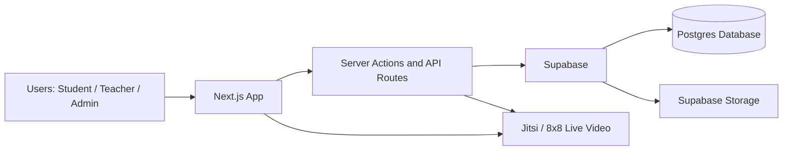
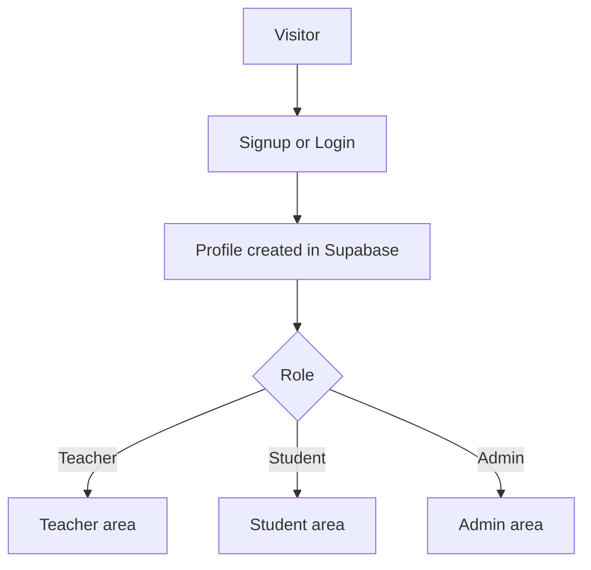
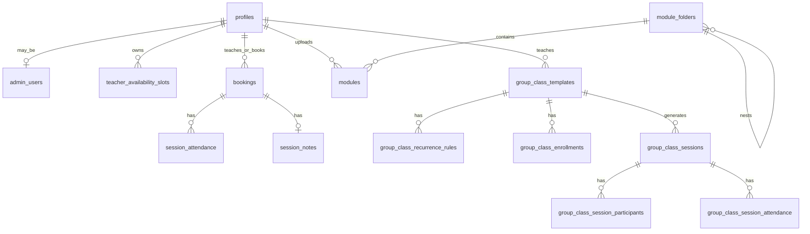
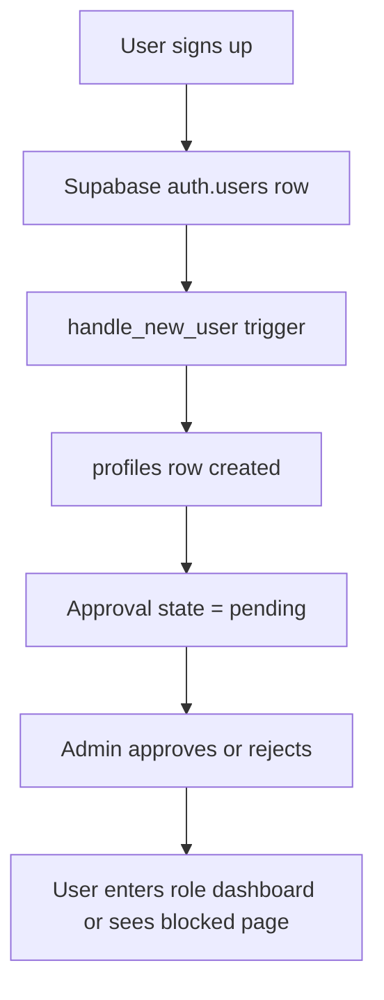
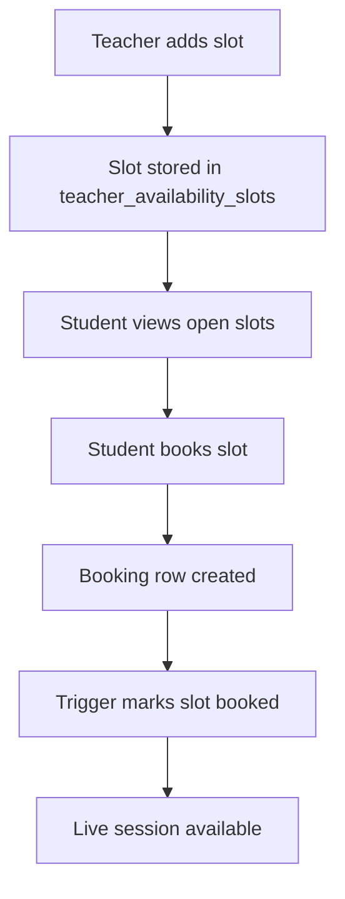
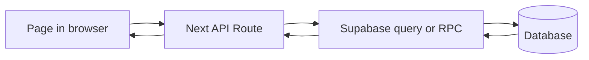
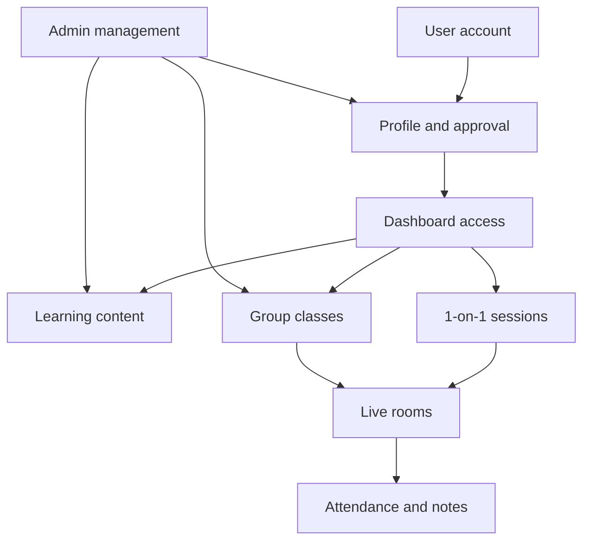

# Kora Thryve System Overview

## Purpose

This document explains the **whole Kora Thryve system** in simple words.

It covers:

- what the product does
- the main parts of the app
- the database structure
- the system architecture
- the main workflows
- how data moves through the app

This is a high-level document. It is meant to help someone quickly understand the project.

---

## What Kora Thryve Is

Kora Thryve is a learning platform with:

- **students**
- **teachers**
- **admins**

The system supports:

- account signup and login
- approval-based access
- teacher and student dashboards
- 1-on-1 bookings
- recurring group classes
- live session attendance
- session notes
- learning modules and shared folders

In simple words:

- students can learn, book sessions, and join classes
- teachers can manage availability, classes, sessions, notes, and modules
- admins can approve users and manage shared content

---

## High-Level Architecture

### Main layers

- **Next.js app**: the website and app pages
- **Server actions and API routes**: secure backend logic inside the app
- **Supabase**: authentication, database access, and file storage
- **Postgres database**: stores users, bookings, classes, attendance, notes, and modules
- **Supabase Storage**: stores PDF learning modules
- **Jitsi / 8x8**: powers live session rooms

---

## Main Product Areas

The system can be understood as 6 big areas.

## 1. Access and identity

This area handles:

- signup
- login
- profile creation
- approval status
- role-based access

Main users:

- teacher
- student
- admin

## 2. 1-on-1 booking system

This area handles:

- teacher availability slots
- student booking of open slots
- live session access
- attendance for 1-on-1 sessions
- notes for 1-on-1 sessions

## 3. Group classes system

This area handles:

- recurring class templates
- recurrence rules
- student enrollments
- generated sessions
- group attendance
- group notes

## 4. Learning modules library

This area handles:

- teacher-uploaded PDF modules
- shared teacher library access
- student read access
- admin module cleanup
- module folders

## 5. Admin management

This area handles:

- approvals
- module management
- group class management

## 6. Live teaching experience

This area handles:

- joining live 1-on-1 sessions
- joining live group sessions
- tracking teacher presence
- tracking attendance
- storing notes

---

## App Route Map

Here is the main route structure.

### Marketing and auth

- `/`
- `/about`
- `/login`
- `/login/student`
- `/login/teacher`
- `/signup`
- `/signup/student`
- `/signup/teacher`
- `/forgot-password`
- `/reset-password`
- `/pending-approval`
- `/access-rejected`

### Student app

- `/student/dashboard`
- `/student/booking`
- `/student/classes`
- `/student/classes/[templateId]`
- `/student/modules`
- `/student/modules/folders/[folderId]`
- `/student/sessions`
- `/student/profile`

### Teacher app

- `/teacher/dashboard`
- `/teacher/availability`
- `/teacher/bookings`
- `/teacher/classes`
- `/teacher/classes/[templateId]`
- `/teacher/attendance`
- `/teacher/attendance/[templateId]`
- `/teacher/group-sessions`
- `/teacher/group-sessions/[sessionId]`
- `/teacher/modules`
- `/teacher/modules/folders/[folderId]`
- `/teacher/sessions`
- `/teacher/students`
- `/teacher/profile`

### Admin app

- `/admin/login`
- `/admin/dashboard`
- `/admin/approvals`
- `/admin/modules`
- `/admin/group-classes`

### Live session pages

- `/session/[bookingId]`
- `/group-session/[sessionId]`
- `/lesson/[id]`

---

## System Flow By Role

### Access rules

- Teachers must be approved before using teacher pages
- Students must be approved before using student pages
- Admins must exist in `admin_users`
- Unauthorized users are redirected away

---

## Main Database Domains

The database is easiest to understand in groups.

## 1. Identity and access tables

### `profiles`

Stores:

- user email
- role
- approval status
- full name

### `admin_users`

Stores:

- which users are admins

Purpose:

- controls admin-only access

## 2. 1-on-1 booking tables

### `teacher_availability_slots`

Stores:

- teacher open times

### `bookings`

Stores:

- confirmed, completed, or cancelled 1-on-1 sessions

### `session_attendance`

Stores:

- who joined a booking session
- when they joined

### `session_notes`

Stores:

- teacher notes for a booking

## 3. Group class tables

### `group_class_templates`

Stores:

- the main group class records

### `group_class_recurrence_rules`

Stores:

- how each class repeats

### `group_class_enrollments`

Stores:

- which students belong to which class

### `group_class_sessions`

Stores:

- generated real class meetings

### `group_class_session_participants`

Stores:

- expected session roster

### `group_class_session_attendance`

Stores:

- who really joined the group session

### `group_class_session_notes`

Stores:

- notes for group sessions

## 4. Learning content tables

### `modules`

Stores:

- PDF learning modules uploaded by teachers

### `module_folders`

Stores:

- folders for organizing modules

### `storage.objects` in bucket `teacher-modules`

Stores:

- the actual PDF files

---

## Database Relationship Map

---

## How Authentication Works

The system uses Supabase Auth.

### Simple flow

1. User signs up
2. A row is created in `auth.users`
3. Trigger `handle_new_user()` creates a row in `profiles`
4. The profile starts as `pending`
5. Admin approves or rejects the user
6. The app redirects based on role and approval state

### Auth flow chart

---

## Main Application Flows

## Flow 1. Student books a 1-on-1 session

1. Teacher creates availability slots
2. Student opens booking page
3. Student sees open slots
4. Student books a slot
5. A row is created in `bookings`
6. The slot becomes booked
7. Teacher and student can open the session page later

## Flow 2. Teacher and student join a 1-on-1 live session

1. User opens `/session/[bookingId]`
2. App checks whether user belongs to that booking
3. Jitsi room is prepared
4. Session attendance API records join time
5. Teacher can edit notes
6. Student can read notes

## Flow 3. Admin manages approvals

1. Admin opens `/admin/approvals`
2. Admin reviews pending profiles
3. Admin updates `approval_status`
4. Approved users can enter their dashboard

## Flow 4. Teacher uploads and shares learning modules

1. Teacher uploads a PDF
2. File is stored in Supabase Storage
3. Module metadata is stored in `modules`
4. Teachers can view the shared library
5. Students can view approved module content
6. Admin can delete modules and folders

## Flow 5. Admin creates and manages group classes

1. Admin creates a group class template
2. Admin adds recurrence rules
3. Admin enrolls students
4. The class becomes visible to the assigned teacher and enrolled students

## Flow 6. Group sessions are generated

1. The system reads active templates
2. It reads recurrence rules
3. It reads active enrollments
4. It creates future session rows
5. It creates session participant snapshot rows

This logic is in:

- `src/lib/group-classes/generation.ts`

## Flow 7. Teacher and student join a group session

1. User opens `/group-session/[sessionId]`
2. App checks room access
3. Jitsi room opens
4. Group session attendance API records join time
5. Teacher presence can be checked
6. Teacher can edit group session notes

## Flow 8. Teacher reviews attendance

1. Teacher opens `/teacher/attendance`
2. App calls teacher attendance RPCs
3. Teacher opens one class attendance sheet
4. The page shows:
   - scheduled sessions
   - teacher and student rows
   - attendance state per session

---

## Backend Patterns

The app uses a few main backend patterns.

## 1. Server-rendered pages

Most app pages load data on the server using Supabase.

Why:

- access is safer
- page data can be preloaded
- redirects happen early

## 2. Server actions

Server actions are used for things like:

- sign out
- deleting modules
- admin updates
- availability and booking updates

## 3. API routes

API routes are used when the UI needs client-side fetch calls.

Examples:

- `/api/session-attendance`
- `/api/session-notes`
- `/api/group-session-attendance`
- `/api/group-session-notes`
- `/api/group-session-teaching-state`
- `/api/profile`

## 4. Database RPCs

RPCs are used for joined, display-ready datasets.

Why:

- the database can do the joins
- the page makes fewer requests
- access checks can stay close to the data

---

## API Flow Example

---

## Security Model

The system uses multiple safety layers.

## 1. Authentication

Users must be signed in through Supabase Auth.

## 2. Role checks

App code checks role before opening protected pages.

Examples:

- `requireApprovedTeacher()`
- `requireApprovedStudent()`
- `requireAdminAccess()`

## 3. Approval checks

Teacher and student access depends on:

- `profiles.role`
- `profiles.approval_status`

## 4. Row Level Security

RLS protects most database tables.

This helps make sure users only see the rows they are allowed to see.

## 5. Security-definer RPCs

Some RPCs use `security definer`.

These functions still perform internal checks using:

- `auth.uid()`
- role checks
- ownership checks

## 6. Storage policies

Supabase Storage policies control who can:

- upload modules
- read modules
- delete modules

---

## External Services

## Supabase

Used for:

- auth
- database
- RLS
- storage
- RPC functions

## Jitsi / 8x8

Used for:

- live teaching rooms
- room access for sessions
- token-based access in hosted mode

The helper is here:

- `src/lib/session/jitsi.ts`

---

## System Workflow Summary

---

## Why The System Is Designed This Way

This structure gives the project a few clear benefits.

### Good points

- authentication and approvals are separated clearly
- teacher and student access are protected
- the database holds the business rules
- RPCs simplify complex page data
- live session attendance is stored separately from class setup data
- modules, bookings, and group classes stay in separate domains

### In simple words

The system is easier to maintain because:

- each feature has its own tables
- each role has its own routes
- access checks happen in more than one place

---

## Main Source Areas

### App pages

- `src/app/(marketing)`
- `src/app/(student)`
- `src/app/(teacher)`
- `src/app/(admin)`

### API routes

- `src/app/api`

### Shared logic

- `src/lib/auth`
- `src/lib/group-classes`
- `src/lib/session`
- `src/lib/supabase`

### Database

- `supabase/migrations`

### Feature docs

- [teacher-group-classes-system.md](/Users/miryldeleon/Documents/Kora-Thryve-Co/docs/teacher-group-classes-system.md)

---

## Short Summary

Kora Thryve is a role-based learning platform built with:

- Next.js for the app
- Supabase for auth, database, storage, and RPCs
- Jitsi for live teaching rooms

Its main business flows are:

1. create user and profile
2. approve access
3. manage modules and classes
4. book or join sessions
5. track attendance and notes

The system is organized around clear domains:

- identity
- bookings
- group classes
- modules
- admin control

That makes the app easier to grow and easier to understand.
